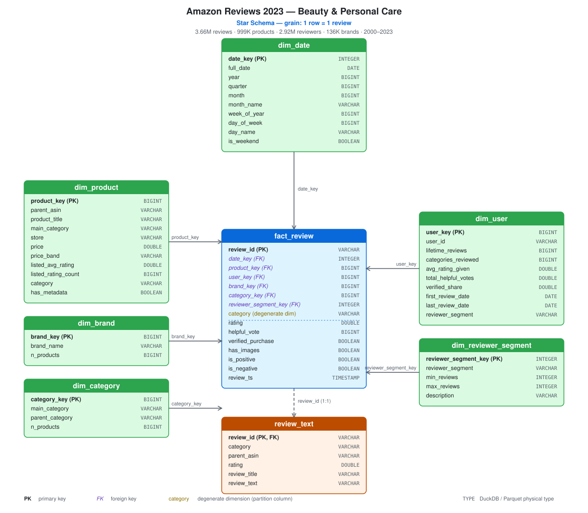
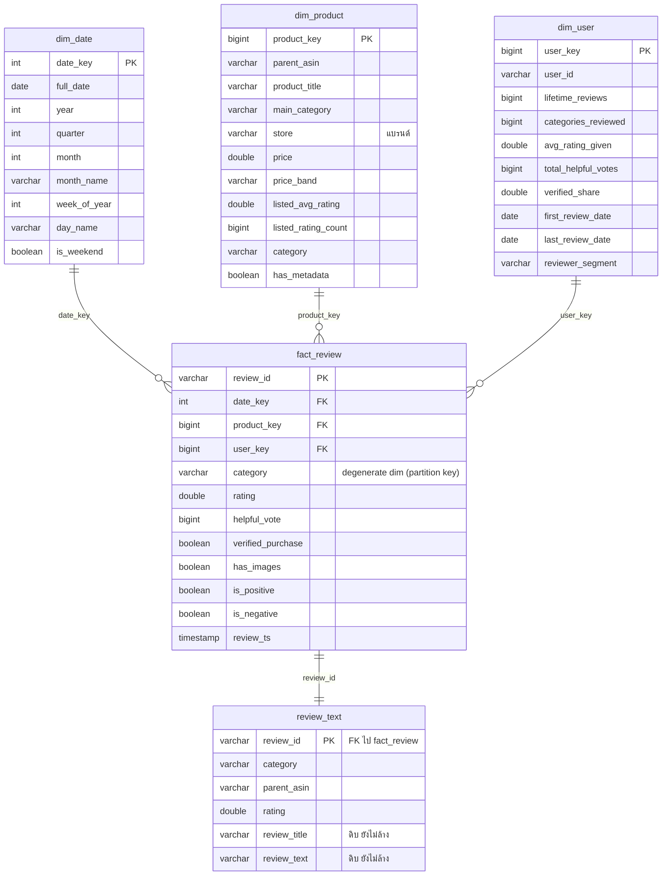

# Product Performance Analytics on Marketplace Data

Data pipeline 2 ขั้นสำหรับชุดข้อมูล [Amazon Reviews 2023](https://huggingface.co/datasets/McAuley-Lab/Amazon-Reviews-2023)
แปลงไฟล์ JSONL ดิบให้กลายเป็น dataset ที่พร้อมใช้บน Hugging Face

```
Hugging Face          ┌──────────── Stage 1: ELT ────────────┐   ┌─ Stage 2: Preprocessing ─┐
(JSONL ดิบ 3 หมวด)     extract → load → transform → export        โหลด → ล้าง → feature → split
       │                        (DuckDB, star schema)                    (DuckDB + notebook)
       └──────────────────────────────┬──────────────────────────────────────┬───────────────
                                      ▼                                      ▼
                          HF dataset #1: star schema          HF dataset #2: พร้อมเทรนโมเดล
```

**ทำไมต้องแยก 2 ขั้น** — dataset #1 เก็บโครงสร้างที่ใกล้เคียงต้นฉบับ (เหมาะกับคนที่อยาก
วิเคราะห์เอง/ทำ feature เอง) ส่วน dataset #2 คือชุดที่ตัดสินใจเรื่อง preprocessing ไปแล้ว
(เหมาะกับคนที่อยากเทรนโมเดลเลย) ถ้าใครไม่เห็นด้วยกับวิธี preprocess ก็ย้อนไปเริ่มจาก #1 ได้
โดยไม่ต้องรัน ELT ใหม่

## ขอบเขตข้อมูล

โฟกัส 3 หมวดที่รวมเป็นหมวดใหญ่เดียวกันได้ — **ความงามและการดูแลตัวเอง**
(Beauty & Personal Care) คือสินค้าที่คนซื้อมาใช้กับร่างกาย/รูปลักษณ์ตัวเอง
ทำให้เปรียบเทียบข้ามหมวดได้อย่างมีความหมาย และรวมกันแค่ ~3.4 GB

| หมวดย่อย | ขนาด (รีวิว + metadata) |
|---|---|
| `All_Beauty` | ~0.54 GB |
| `Health_and_Personal_Care` | ~0.35 GB |
| `Amazon_Fashion` | ~2.47 GB |

เปลี่ยนหมวดได้ที่ `categories` ใน [config.yaml](config.yaml)

## Stage 1 — ELT ([elt/](elt/))

| ขั้น | ไฟล์ | ทำอะไร |
|---|---|---|
| **E**xtract | [elt/extract.py](elt/extract.py) | ดาวน์โหลด JSONL จาก HF ลง `data/raw/` (resume ได้) |
| **L**oad | [elt/load.py](elt/load.py) | โหลดเข้า DuckDB schema `raw` ตามสภาพเดิม กำหนดแค่ type |
| **T**ransform | [elt/transform.py](elt/transform.py) + [elt/sql/](elt/sql/) | `raw` → `staging` → `marts` (star schema) |
| Export | [elt/export.py](elt/export.py) | เขียน Parquet + สร้าง dataset card จากตัวเลขจริง |
| Publish | [elt/publish.py](elt/publish.py) | อัพขึ้น Hugging Face |

**สิ่งที่ทำในขั้นนี้**

- ลบรีวิวซ้ำด้วย (`user_id`, `asin`, `timestamp`)
- กรองแถวเสีย: rating นอกช่วง 1–5, ไม่มี user/product/timestamp,
  timestamp เพี้ยนนอกช่วงปี 1996–2023
- แปลง `price` จาก string (`"None"`, `"14.99"`) เป็นตัวเลข แล้วจัดกลุ่มเป็น `price_band`
- สินค้าที่มีรีวิวแต่ไม่มี metadata ยังได้แถวใน `dim_product` (ธง `has_metadata = false`)
  → fact ไม่มีแถวกำพร้า
- quality checks 10 ข้อ ถ้าไม่ผ่านสักข้อ export จะไม่ยอมเขียนไฟล์ออก

**ยังไม่ทำ** — ล้าง HTML ในข้อความ, feature engineering, แบ่ง train/test (ยกไป stage 2
เพื่อให้ dataset #1 ใกล้เคียงต้นฉบับที่สุด)

### Star schema

Grain: **1 แถว = 1 รีวิว**



<details>
<summary>ดูเป็น ER diagram (Mermaid) — คลิกเพื่อขยาย</summary>



</details>

ไฟล์ diagram: [docs/star_schema.svg](docs/star_schema.svg) (รูป) และ
[docs/star_schema.drawio](docs/star_schema.drawio) (แก้ไขได้ด้วย
[app.diagrams.net](https://app.diagrams.net) หรือ extension draw.io ใน VS Code)

**สองจุดที่ออกแบบไว้เป็นพิเศษ**

- **`review_text` แยกออกจาก fact** — ข้อความรีวิวกินพื้นที่มากกว่าคอลัมน์อื่นรวมกัน
  แยกออกแล้ว `fact_review` เหลือ 120 MB โหลดเข้า pandas บนโน้ตบุ๊กได้สบาย
  (join กลับด้วย `review_id` เมื่อต้องใช้ข้อความ)
- **`category` ซ้ำอยู่ใน fact** ทั้งที่มีใน `dim_product` แล้ว — ใช้เป็น partition key
  ตอน export Parquet ปลายทางจึงอ่านทีละหมวดได้โดยไม่ต้องสแกนทั้งชุด

| ตาราง | Grain | คอลัมน์เด่น |
|---|---|---|
| `fact_review` | 1 รีวิว | `rating`, `helpful_vote`, `verified_purchase`, `has_images`, `is_positive/negative` |
| `dim_product` | 1 สินค้า (`parent_asin`) | `product_title`, `store` (แบรนด์), `price`, `price_band`, `has_metadata` |
| `dim_user` | 1 คนรีวิว | `lifetime_reviews`, `categories_reviewed`, `avg_rating_given`, `reviewer_segment` |
| `dim_date` | 1 วัน | `year`, `quarter`, `month`, `day_name`, `is_weekend` |
| `review_text` | 1 รีวิว | ข้อความ**ดิบ** แยกออกมาเพื่อให้ fact table เล็ก |

`dim_user` สร้างจากประวัติการรีวิว เพราะชุดข้อมูลต้นทางไม่มีโปรไฟล์ผู้ใช้แยกมาให้

## Stage 2 — Preprocessing ([preprocessing/preprocessing.ipynb](preprocessing/preprocessing.ipynb))

Notebook ที่โหลด star schema จาก HF (dataset #1) แล้วแปลงให้พร้อมเทรนโมเดล
ถ้ายังไม่ได้ push จะถอยไปอ่าน `data/elt_export/` ในเครื่องอัตโนมัติ — รันได้ตั้งแต่ก่อน push

**สิ่งที่ทำในขั้นนี้**

1. **ล้างข้อความ** — ลบ HTML tag (`<br />`, `<span>`) และ entity (`&#34;`, `&amp;`, `&nbsp;`)
   ยุบช่องว่างซ้ำ (`&amp;` ถอดรหัสท้ายสุด กัน `&amp;quot;` ที่ escape สองชั้นแปลงผิด)
2. **กรอง** — ตัดรีวิวที่เหลือน้อยกว่า 3 คำหลังล้าง
3. **สร้าง label** — `sentiment` (negative/neutral/positive) จาก rating
4. **feature ของข้อความ** — `word_count`, `char_count`, `avg_word_length`,
   `exclamation_count`, `question_count`, `uppercase_ratio`, `digit_count`
5. **รวม feature จาก dimension** — ราคา, แบรนด์, พฤติกรรมผู้รีวิว, สถิติของสินค้า
   (`product_avg_rating`, `rating_vs_product_avg`, `days_since_product_first_review`)
   → ปลายทางไม่ต้อง join เอง
6. **แบ่ง train/val/test ตามเวลา** ไม่ใช่สุ่ม เพื่อกัน data leakage
   (train < 2021, val = 2021, test ≥ 2022 — เลื่อนมาจากเดิม 2022/2023 เพราะปริมาณรีวิว
   ปี 2022 เป็นต้นไปเก็บไม่ครบ ทำให้ test เดิมเหลือแค่ ~1.7% ของข้อมูล)
7. **ตรวจคุณภาพ** — ยืนยันว่าช่วงเวลาของแต่ละ split ไม่ทับกัน, ไม่มี null ในคอลัมน์บังคับ,
   `review_id` ไม่ซ้ำ แล้วรายงานความไม่สมดุลของคลาส

ผลลัพธ์: `reviews/` (แบ่ง partition ตาม `split`) และ `product_features.parquet`
(1 แถว = 1 สินค้า พร้อมสถิติสำหรับจัดอันดับ/หาสินค้าขาลง)

> ใช้ DuckDB เป็นตัวประมวลผลหลักแทน pandas เพราะข้อมูลหลายล้านแถวที่มีข้อความยาว
> ถ้าโหลดเข้า pandas ทั้งก้อนจะกิน RAM หนัก — DuckDB ทำงานบน Parquet ได้โดยตรงและ
> spill ลงดิสก์เองเมื่อหน่วยความจำไม่พอ ส่วน pandas ใช้ดูผลลัพธ์ระหว่างทาง

## Notebook ตัวอย่างสำหรับเอาไปใช้ต่อ

โหลด dataset จาก Hugging Face มาใช้เลย (ถ้ายังไม่ได้ push จะถอยไปอ่านไฟล์ในเครื่องอัตโนมัติ)
เปิดแล้ว Run All ได้ทันที

| Notebook | ใช้ dataset | ทำอะไร |
|---|---|---|
| [preprocessing/exploration.ipynb](preprocessing/exploration.ipynb) | #1 star schema | **EDA** — สำรวจข้อมูลก่อน preprocess ทุกหัวข้อจบด้วย "ข้อสรุป → การตัดสินใจ" ที่ไปปรากฏจริงใน pipeline |
| [analytics/analytics.ipynb](analytics/analytics.ipynb) | #1 star schema | ตอบคำถาม **A1–A5** ด้วย SQL + กราฟ ไม่ต้องสร้างโมเดล |
| [analytics/Answer_Analytic.ipynb](analytics/Answer_Analytic.ipynb) | #1 star schema | เวอร์ชัน **Q1–Q5** — ภาพรวมชี้สัญญาณก่อนแตกเป็นคำถาม พร้อมข้อเสนอแนะต่อข้อ |
| [model/model.ipynb](model/model.ipynb) | #2 พร้อมเทรน | โมเดล **B1–B5** ครบ: regression, classification, clustering, topic modeling, anomaly detection — **เทรนแล้วบันทึกโมเดลจริงไว้ที่ `data/model_artifacts/*.joblib`** |

`model/model.ipynb` sample ข้อมูลไว้ให้รันจบในไม่กี่นาทีบน CPU (ปรับ `TRAIN_SAMPLE = None`
ถ้าอยากใช้ครบ 2.58 ล้านแถว) ทุกโมเดลเทียบกับ **baseline** เสมอ — ผลจริงคือ B1 (regression)
**ไม่ชนะ baseline เลย** ซึ่งรายงานไว้ตรง ๆ ไม่ปรับแต่งให้ดูดีกว่าความเป็นจริง

## Dashboard — Streamlit

```bash
streamlit run dashboard/app.py
```

Interactive dashboard ที่รวมคำถามธุรกิจทั้งหมด (Q1–Q5 และ B1–B5) ไว้ในที่เดียว:

- **ข้อมูลสด (แท็บ Analytics)** — query ตรงบน **dataset #1 (star schema ที่ผ่าน ELT
  pipeline แล้ว)** ผ่าน DuckDB ทุกครั้งที่เปลี่ยน filter
- **ผลโมเดล (แท็บ Model Insights)** — โหลดจากโมเดลที่ **เทรนและบันทึกไว้ล่วงหน้าแล้ว**
  ที่ `data/model_artifacts/*.joblib` (ตัวโมเดล) และ `data/model_output/*` (ตาราง)
  จาก `model/model.ipynb` — dashboard **ไม่ retrain สดในแอป**

**ต้องรันก่อนเปิด dashboard ครั้งแรก** (ครั้งเดียว ใช้เวลาไม่กี่นาที):

```bash
jupyter execute model/model.ipynb   # หรือเปิดใน Jupyter/VS Code แล้ว Run All
```

ถ้ายังไม่รัน แท็บ Model Insights จะขึ้น "ยังไม่มีผลลัพธ์ — รัน model/model.ipynb ก่อน"
แทนที่จะพัง

**สิ่งที่มีใน dashboard**

| ส่วน | รายละเอียด |
|---|---|
| Filter | หมวดสินค้า (multiselect), ช่วงปี (slider), เฉพาะ verified purchase (checkbox) |
| Measures | จำนวนรีวิว, คะแนนเฉลี่ย, สัดส่วนรีวิวเชิงลบ, สัดส่วนซื้อจริง |
| กราฟแนวโน้มเวลา | ปริมาณรีวิว+คะแนนรายปี, สัดส่วนหัวข้อร้องเรียนรายปี (B4) |
| กราฟเปรียบเทียบ | คะแนนข้ามหมวด, แบรนด์, ช่วงราคา, กลุ่มผู้รีวิว, โมเดล vs baseline (B1/B2) |
| Interactive control เพิ่มเติม | เลือก cluster เพื่อดูสินค้าจริง (B3), แท็กรีวิวต้องสงสัยด้วยตัวเอง (B5) |
| Insights & ข้อเสนอแนะ | คำนวณสดตาม filter ปัจจุบัน — อย่างน้อย 7 ข้อ พร้อมข้อเสนอแนะเชิงธุรกิจ |
| ข้อจำกัดของข้อมูล | สรุปทุกอคติ/ข้อจำกัดที่ต้องรู้ก่อนเชื่อตัวเลขในหน้านี้ |

## วิธีรัน

```bash
python -m venv .venv && source .venv/bin/activate
pip install -r requirements.txt
```

**Stage 1:**

```bash
python -m elt.run_elt
```

รัน extract → load → transform → export ครบ (ครั้งแรกดาวน์โหลด ~3.4 GB)
รันทีละขั้นก็ได้: `python -m elt.extract`, `python -m elt.load`,
`python -m elt.transform`, `python -m elt.export`

จากนั้นแก้ `elt.repo_id` ใน [config.yaml](config.yaml) เป็น `<hf-username>/<dataset-name>`

**ตั้งค่า token** — เลือกทางใดทางหนึ่ง:

```bash
huggingface-cli login
```

หรือถ้าชอบใช้ `.env` — คัดลอกไฟล์ตัวอย่างแล้วใส่ token ของตัวเองลงไป
(`.env` ถูก gitignore ไว้แล้ว และโค้ดจะอ่าน `HF_TOKEN` ให้อัตโนมัติ):

```bash
cp .env.example .env
```

แล้ว push:

```bash
python -m elt.publish --dry-run
python -m elt.publish
```

> **อย่าวาง token จริงลงในแชท, commit, หรือ notebook** — ถ้าเผลอวางไปแล้ว
> ให้ไป revoke ที่ https://huggingface.co/settings/tokens แล้วสร้างใหม่ทันที

**Stage 2:** เปิด [preprocessing/preprocessing.ipynb](preprocessing/preprocessing.ipynb)
ใน Jupyter/VS Code แล้ว Run All — cell สุดท้ายตั้ง `dry_run=True` ไว้
เปลี่ยนเป็น `False` เมื่อพร้อม push จริง

> repo ทั้งสองชุดสร้างเป็น **private** ก่อนเสมอ ค่อยไปกดเปิด public บนเว็บ HF ทีหลัง
> เมื่อตรวจแล้วพอใจ

### พื้นที่ดิสก์

| อะไร | ประมาณ |
|---|---|
| `data/raw/` (JSONL ดิบ) | ~3.4 GB |
| `data/warehouse/` (DuckDB) | ~4–6 GB |
| `data/elt_export/` + `data/preprocessed/` (Parquet) | ~2 GB |

รวม ~10 GB — ถ้า RAM น้อยให้ลด `elt.memory_limit` ใน config
DuckDB จะ spill ลงดิสก์เองแทนที่จะ crash

## Dataset ที่ push แล้ว

| ชุด | ลิงก์ | เนื้อหา |
|---|---|---|
| #1 star schema | [Madnesss/amazon-beauty-star-schema](https://huggingface.co/datasets/Madnesss/amazon-beauty-star-schema) | 3.66M รีวิว, 999K สินค้า, 2.92M ผู้รีวิว (535 MB) |
| #2 พร้อมเทรนโมเดล | [Madnesss/amazon-beauty-analytics-ready](https://huggingface.co/datasets/Madnesss/amazon-beauty-analytics-ready) | 3.37M รีวิวล้างแล้ว + feature + split (656 MB) |

ทั้งสองชุดเป็น **private** — ถ้าจะให้เพื่อนเข้าถึงต้องเชิญเข้า repo
หรือกดเปลี่ยนเป็น public ที่หน้า Settings ของ dataset บน HF

```python
import pandas as pd

# ชุดพร้อมเทรน (dataset #2)
train = pd.read_parquet("hf://datasets/Madnesss/amazon-beauty-analytics-ready/reviews",
                        filters=[("split", "=", "train")])
X, y = train["text_full"], train["sentiment"]

# ชุด star schema (dataset #1) — อยากทำ feature เอง
fact = pd.read_parquet("hf://datasets/Madnesss/amazon-beauty-star-schema/fact_review",
                       filters=[("category", "=", "All_Beauty")])
```

### ตัวเลขจริงหลังรันจบ

| | รีวิว | สินค้า | ผู้รีวิว | ช่วงเวลา |
|---|---|---|---|---|
| Amazon_Fashion | 2,475,694 | 825,869 | 2,035,490 | 2002–2023 |
| All_Beauty | 694,252 | 112,565 | 631,986 | 2000–2023 |
| Health_and_Personal_Care | 488,990 | 60,274 | 461,656 | 2001–2023 |

การแบ่ง split ของ dataset #2: train 2,581,670 (77%) / val 467,957 (14%) / test 320,143 (10%)

## คำถามธุรกิจ

รายละเอียดเต็มพร้อม SQL ที่รันได้จริงและวิธีตั้งโจทย์โมเดล:
**[docs/business_questions.md](docs/business_questions.md)**

**กลุ่ม A — ตอบได้จากการ analyze** (SQL/pandas ไม่ต้องสร้างโมเดล)

| # | คำถาม | ได้อะไร |
|---|-------|--------|
| A1 | แบรนด์ไหนแข็งที่สุดในแต่ละหมวดย่อย | ตาราง benchmark |
| A2 | ราคาแพงขึ้นแล้วลูกค้าพอใจขึ้นจริงไหม | จุดที่ตั้งราคาเกินคุณค่า |
| A3 | สินค้าไหนกำลังขาลง (คะแนนช่วงหลังตก) | รายชื่อสินค้าต้องเฝ้าระวัง |
| A4 | รีวิวแบบไหนที่คนบอกว่ามีประโยชน์ | เกณฑ์จัดลำดับรีวิว |
| A5 | 3 หมวดต่างกันแค่ไหน คะแนนใครน่าเชื่อถือน้อยสุด | เงื่อนไขการเทียบข้ามหมวด |

**กลุ่ม B — ต้องสร้างโมเดล** (ใช้ dataset #2 เป็น feature/label ได้เลย)

| # | คำถาม | โมเดล |
|---|-------|-------|
| B1 | สินค้าใหม่จะได้คะแนนเท่าไหร่ | Regression |
| B2 | ข้อความในรีวิวตรงกับดาวที่ให้ไหม | Classification (NLP) |
| B3 | สินค้าแบ่งได้เป็นกี่กลุ่มตาม performance | Clustering |
| B4 | ลูกค้าบ่นเรื่องอะไรในรีวิวเชิงลบ | Topic modeling |
| B5 | รีวิวไหนน่าสงสัยว่าปลอม/จ้าง | Anomaly detection |

หลักแบ่งง่าย ๆ: ถ้า `GROUP BY` ตอบได้ = กลุ่ม A ส่วนคำถามที่ต้อง**อ่านข้อความอิสระ**,
**ทำนายอนาคต** หรือ**หาโครงสร้างที่ซ่อนอยู่** = กลุ่ม B

## ข้อควรระวัง

- รีวิวเดียวอาจปรากฏในไฟล์หมวดมากกว่าหนึ่งไฟล์ การ dedupe ยุบเหลือแถวเดียว
  จำนวนรายหมวดจึงต่ำกว่าจำนวนบรรทัดในไฟล์ดิบเล็กน้อย
- `dim_user` คำนวณจาก 3 หมวดนี้เท่านั้น ไม่ใช่ประวัติ Amazon ทั้งหมดของคนนั้น
- จำนวนรีวิวเป็นตัวแทนคร่าว ๆ ของดีมานด์ **ไม่ใช่ยอดขาย** — ต้นทางไม่มีข้อมูลยอดขาย
- คลาสไม่สมดุล รีวิว 4–5 ดาวเยอะกว่ามาก ตอนเทรนควรใช้ `class_weight` หรือ resampling
- `product_avg_rating` คำนวณจากทั้งชุด ถ้าซีเรียสเรื่อง leakage ให้คำนวณใหม่จากเฉพาะ train

## โครงสร้างโปรเจกต์

```
config.yaml                      ตั้งค่ากลาง: หมวด, DuckDB, export, repo_id ทั้งสอง stage
elt/
  common.py                      โหลด config, เปิด DuckDB, ฟังก์ชัน push ขึ้น HF
  extract.py                     ดาวน์โหลด JSONL จาก Hugging Face
  load.py                        โหลดเข้า DuckDB schema raw
  transform.py                   รัน SQL ตามลำดับ + quality checks
  sql/10_staging.sql             raw -> staging (type, dedupe, กรองแถวเสีย)
  sql/20_dimensions.sql          dim_date, dim_product, dim_user
  sql/30_facts.sql               fact_review + review_text
  sql/40_quality_checks.sql      view ตรวจคุณภาพ + สรุปรายหมวด
  export.py                      marts -> Parquet + dataset card
  dataset_card.py                template dataset card ของทั้งสอง stage
  publish.py                     push dataset #1 ขึ้น HF
  run_elt.py                     รัน stage 1 ครบทุกขั้น
preprocessing/
  exploration.ipynb              EDA: สำรวจข้อมูล -> เหตุผลของทุกการตัดสินใจ preprocess
  preprocessing.ipynb            stage 2 ทั้งหมด: โหลด → ล้าง → feature → split → push
analytics/
  analytics.ipynb                ตอบคำถาม A1-A5 (ไม่ต้องใช้โมเดล)
  Answer_Analytic.ipynb          เวอร์ชัน Q1-Q5 พร้อมข้อเสนอแนะต่อข้อ
model/
  model.ipynb                    โมเดล B1-B5 ครบ — เทรนแล้วบันทึกโมเดลจริงที่ data/model_artifacts/
dashboard/
  app.py                         Streamlit dashboard — รวมทุกคำถามธุรกิจไว้ที่เดียว
  charts.py                      ตัวสร้างกราฟ Plotly ทั้งหมด
  data_loader.py                 query สดผ่าน DuckDB (dataset #1) + โหลดผลโมเดลที่เทรนไว้แล้ว
docs/
  business_questions.md          คำถามธุรกิจ 10 ข้อ + SQL + วิธีตั้งโจทย์โมเดล
  star_schema.drawio             ER diagram แบบแก้ไขได้ (draw.io)
  star_schema.svg                ER diagram แบบรูปภาพ (ใช้ใน README)
data/                            ไฟล์ดิบ + warehouse + export + model_output + model_artifacts
                                 (ทั้งหมด gitignore ไว้ — รัน pipeline/notebook ใหม่เพื่อสร้างคืน)
```
